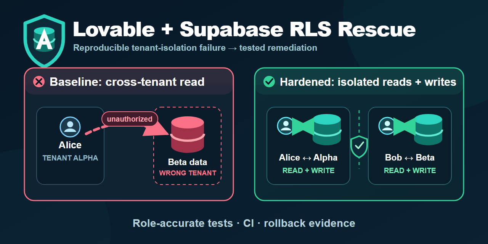
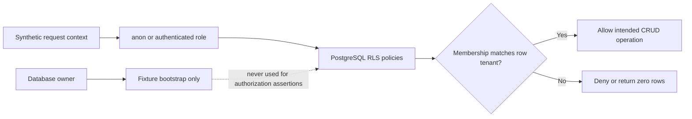

# Lovable + Supabase RLS Rescue

[](https://github.com/VJO-JavaScript/lovable-supabase-rls-rescue/actions/workflows/ci.yml)

An executable before/after proof for a multi-tenant Supabase Row Level Security
(RLS) failure: an authenticated Alpha Company user could read Beta Company's
private document; the hardened policy limits each user's reads and writes to
their own tenant.

> [!IMPORTANT]
> **Reference-work disclosure:** this is synthetic portfolio/reference work,
> built to demonstrate a reproducible rescue method. It is not client work, a
> production incident, a penetration test, or evidence that any real Lovable or
> Supabase application was exposed.



- [Inspect the preserved vulnerable baseline](https://github.com/VJO-JavaScript/lovable-supabase-rls-rescue/tree/broken-baseline)
- [Inspect the hardened main branch](https://github.com/VJO-JavaScript/lovable-supabase-rls-rescue/tree/main)
- [Compare the baseline with v1.1.0](https://github.com/VJO-JavaScript/lovable-supabase-rls-rescue/compare/broken-baseline...v1.1.0)
- [Review the finding](docs/audit/baseline-findings.md)
- [Review the remediation ledger](docs/audit/remediation-ledger.md)
- [Review rollback and residual risk](docs/operations/rollback-runbook.md)

## Verified outcome

| Request context | Broken baseline | Hardened main |
|---|---:|---:|
| Anonymous visitor | 0 documents | 0 documents |
| Alice, Alpha member | Alpha + **Beta** | Alpha only |
| Bob, Beta member | Alpha + **Beta** | Beta only |
| Direct cross-tenant ID probe | Leaks row | Returns 0 rows |
| Cross-tenant insert / row move | Not in baseline | Denied by `WITH CHECK` |
| Cross-tenant update / delete | Not part of baseline | Affects 0 rows |

The baseline and remediation run in separate ephemeral databases. Passing the
baseline test means the historical vulnerability was successfully reproduced;
it does not mean that policy is safe.



## Two-minute reviewer path

1. See the [baseline finding](docs/audit/baseline-findings.md).
2. Inspect the [read fix](db/migrations/0002_enforce_tenant_membership.sql)
   and [write guard](db/migrations/0003_enforce_tenant_writes.sql).
3. Review the [read isolation test](test/rescued-tenant-isolation.test.js) and
   [write matrix](test/rescued-write-matrix.test.js).
4. Check the green [CI evidence](https://github.com/VJO-JavaScript/lovable-supabase-rls-rescue/actions).
5. Read the [test-boundary decision](docs/decisions/0001-pglite-test-boundary.md)
   before applying the pattern to hosted Supabase.

## Run the evidence

Requirements: Node.js 20 or newer. No Docker, environment variables, hosted
database, Supabase account, or production credentials are required.

```bash
npm ci
npm run check
npm test
npm run demo
```

Expected evidence markers:

```text
BROKEN BASELINE CONFIRMED ... observedUnauthorizedTenant:"22222222-..."
RESCUE VERIFIED ... crossTenantProbesReturned:0
WRITE MATRIX VERIFIED ... tenantMove:"denied"
tests 3 | pass 3 | fail 0
```

Run either side independently:

```bash
npm run test:baseline
npm run test:rescued
```

## Root cause and remediation

The unsafe policy in `0001_broken_baseline.sql` checks only whether the request
has an authenticated identity:

```sql
using (auth.uid() is not null)
```

Authentication is not tenant authorization. The separate, atomic `0002`
migration removes that policy and requires a membership matching both the
request identity and the document's organization:

```sql
using (
  exists (
    select 1
    from public.organization_memberships as membership
    where membership.organization_id = documents.organization_id
      and membership.user_id = auth.uid()
  )
)
```

Migration `0003` applies the same membership boundary to document writes. Its
update policy uses both `USING` and `WITH CHECK`: a user must be authorized for
the existing row and for its post-update tenant, preventing a visible row from
being moved into another organization.

The fixture bootstrap runs as the local database owner. Every access-control
assertion runs as `anon` or `authenticated` with a transaction-local JWT
subject. No service/admin role is used to make an authorization assertion.

## Evidence map

- [`0001_broken_baseline.sql`](db/migrations/0001_broken_baseline.sql)
  Synthetic vulnerable schema and fixtures.
- [`0002_enforce_tenant_membership.sql`](db/migrations/0002_enforce_tenant_membership.sql)
  Minimal forward remediation.
- [`0003_enforce_tenant_writes.sql`](db/migrations/0003_enforce_tenant_writes.sql)
  Tenant-scoped insert, update, and delete policies.
- [`broken-baseline.test.js`](test/broken-baseline.test.js)
  Deterministic failure reproduction.
- [`rescued-tenant-isolation.test.js`](test/rescued-tenant-isolation.test.js)
  Two-sided tenant regression coverage.
- [`rescued-write-matrix.test.js`](test/rescued-write-matrix.test.js)
  Role-accurate same-tenant and cross-tenant write coverage.
- [`0001-pglite-test-boundary.md`](docs/decisions/0001-pglite-test-boundary.md)
  Why this portable harness is useful and where its assurance stops.
- [`remediation-ledger.md`](docs/audit/remediation-ledger.md)
  Finding-to-control traceability.
- [`rollback-runbook.md`](docs/operations/rollback-runbook.md)
  Fail-closed recovery procedure.
- [`residual-risks.md`](docs/operations/residual-risks.md)
  Explicit limits and next tests.
- [`manifest.json`](runs/2026-07-10-v1.1.0/manifest.json)
  Version 1.1.0 verification record.

## Scope boundaries

PGlite exercises PostgreSQL roles and RLS, but this repository is not a complete
Supabase emulator. It does not validate hosted Auth/JWT verification, PostgREST,
Realtime, Storage, Edge Functions, production migrations, or other application
tables. See [residual risks](docs/operations/residual-risks.md) before adapting
the pattern.

Never deploy the vulnerable migration, connect this harness to client data, or
treat a passing local test as production authorization. A real rescue should
reproduce the problem in an authorized non-production environment, define the
acceptance test, preserve a recovery path, and reverify the hosted boundary.

## Is this pattern relevant to your blocker?

This reference is closest to a Lovable/Supabase application that already has a
reproducible multi-tenant read leak or an RLS launch blocker. You can open a
[public fit-check issue](https://github.com/VJO-JavaScript/lovable-supabase-rls-rescue/issues/new?template=fit-check.yml)
using only redacted, non-sensitive facts.

**GitHub issues are public. Never include secrets, tokens, private repository or
staging URLs, customer data, personal data, proprietary code, or exploit steps
against a system you do not own or lack authorization to test.** Security
reports belong in GitHub's private vulnerability reporting flow described in
[SECURITY.md](SECURITY.md).

## License

MIT
